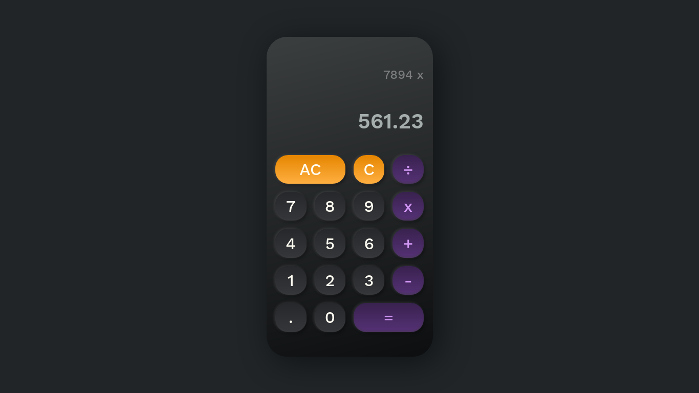

# Calculator

Project for [TOP](https://www.theodinproject.com/courses/foundations/lessons/calculator) to create Calculator using only HTML, Sass and Vanilla JavaScript.

👉 [Live preview](https://nicolasr98.github.io/calculator/)

## Built with

### Technologies

* HTML5
* Sass
* JavaScript (ES6)

### Tools

* Visual Studio Code
* Linux terminal (ZSH)
* Figma
* [BEM Methodology](http://getbem.com/introduction/)
* Architecture based on [SMACSS/BEM](https://vanseodesign.com/css/sass-directory-structures/)

### Third party code

* [Google Fonts](https://fonts.google.com/)

## Outcome

* Used HTML5 **semantic elements** for better readability and structure.
* Used Sass **partials**, **mixins** and **variables** to create a modular structure.
* Used **Git** and **GitHub** for project management.

## Summary

### What I learned

* Better knowledge of **JavaScript OOP** and **CSS GRID**.
* Learned a lot of how to structure my projects with SMACSS and BEM.

## Author

👨‍💻 **NicolasR98**
 
 

